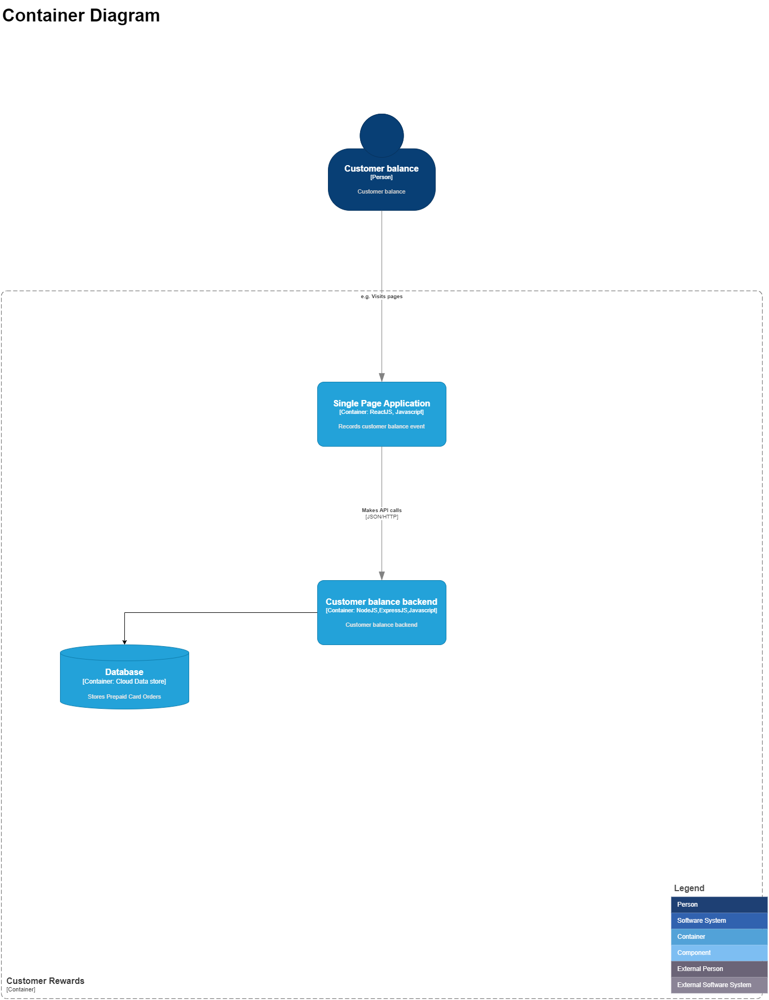
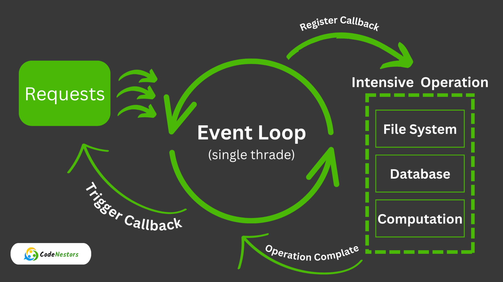

# FullStack Development Session
## Agenda

1. Intro - 5 min
2. Setup your environment
3. Develop React Frontend
4. Develop NodeJS API (Complete in Session 2)
5. Wrap up

# Agenda
> Envrionment Setup ( Walkthrough of react setup)

> Build a react frontend consuming node js backend

> Deploy to google cloud (Cloud run)

## Prerequisites

1) Node JS
2) Vs Code Editor

## Front end Envrionment Setup
1) npx create-react-app {appname}
2) Walk through of project files
3) npm start

## Code formatter
* Install Prettier and Eslint extesions in VSCode
* Check(in VSCode) that the extension pick up the config files `.eslintrc.json` and `.prettierrc`,refer references folder you may have to open VSCode in the correct folder.

## Architecure

### Application Diagram

### React application

1) Create a balance app which creates a balance event
2) Create a add balance view
3) Create a service layer to fetch the balances
4) Create a balance list component

### Backend API
NodeJS Intro

  

1) Create a nodeJs backend based on express
2) Create a controller - Create balance, Get Balance

### Deploy application

1) Deploy frontend and backend in cloud
